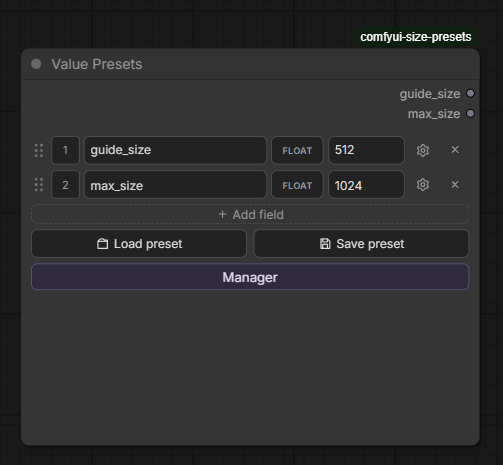
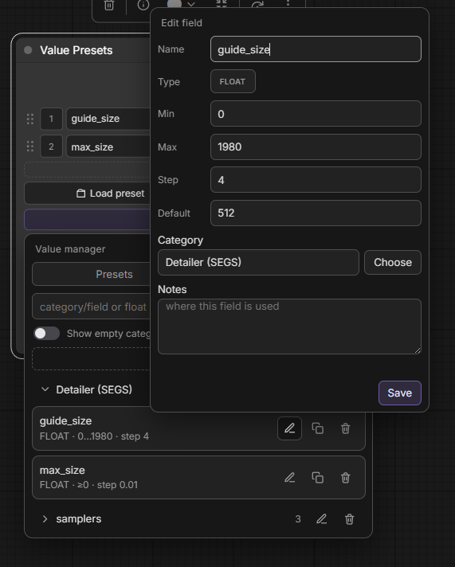
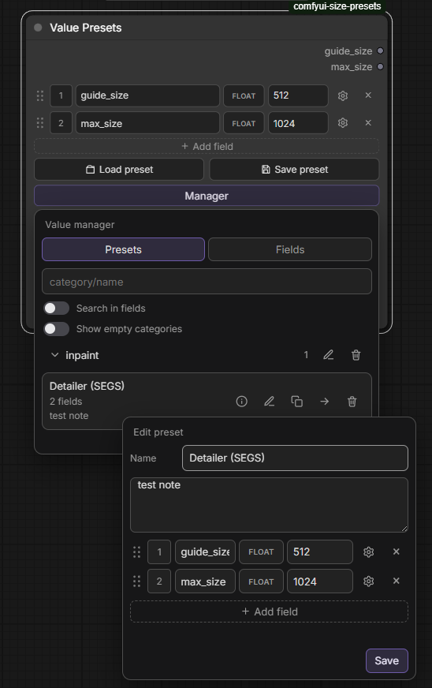
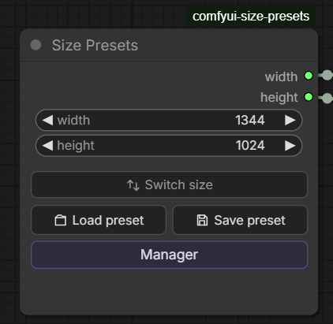
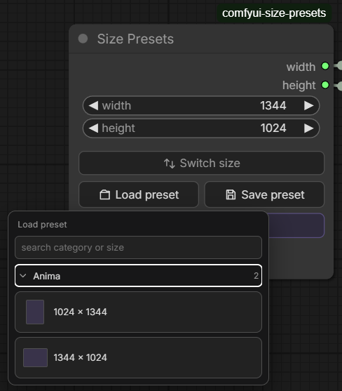
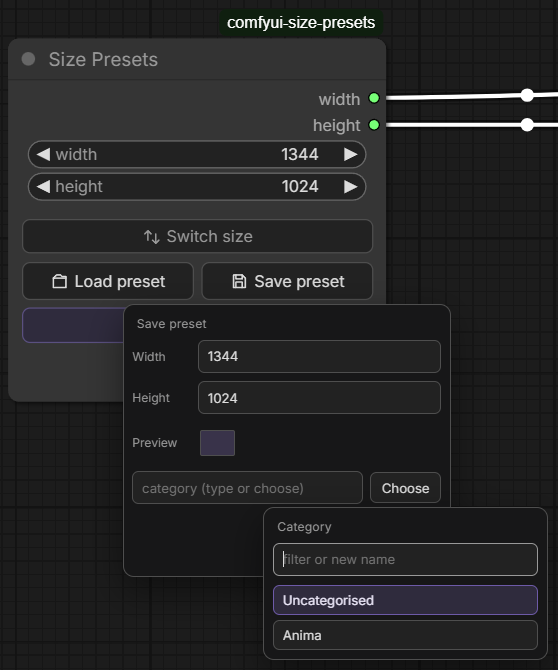
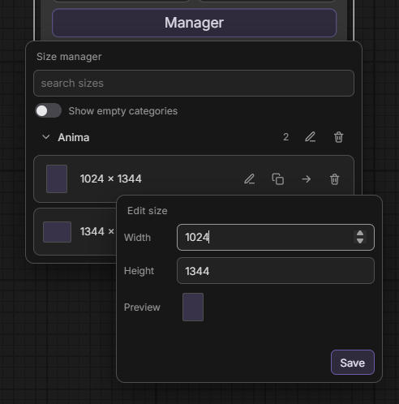

# ComfyUI Size Presets

**Save and load image sizes — and named INT/FLOAT values — with categories.**

Two nodes, one local **SQLite library**: classic **width/height** presets, plus dynamic **Value Presets** for any named numbers (cfg, steps, denoise, …) with typed sockets.

MIT — see [LICENSE](LICENSE)

---

## Screenshots

### Value Presets · 2.0

| Node | Field library |
| ---- | ------------- |
|  |  |

| Manager · edit preset |
| --------------------- |
|  |

### Size Presets

| Node | Load preset |
| ---- | ----------- |
|  |  |

| Save preset | Manager |
| ----------- | ------- |
|  |  |

---

## Features

### Size Presets

- **Native width / height** — INT widgets you can pin and wire to Empty Latent Image, etc.
- **Save / Load / Manager** — categories, search, copy/move
- **Switch size** — swap width ↔ height
- **Size = identity** — `1024 × 768` (no extra naming)

### Value Presets

- **Dynamic fields** — name + INT/FLOAT + value (up to 16); empty node allowed
- **Typed outputs** — each field is an INT or FLOAT socket (type fixed after create; replace via type badge)
- **Reorder** — drag handle + position number
- **Field library** — reusable defs with min / max / step, category, notes; gear → Save to library
- **Same library UX** — Load / Save / Manager with categories and notes
- **Search** — `category/…` · `category:…` · `category\…`, then AND tokens; optional **Search in fields**
- **Manager** — Presets + Fields tabs; edit / copy / move / delete

---

## Install

1. Clone into `ComfyUI/custom_nodes/`:

    ```bash
    git clone https://github.com/StoneZol/comfyui-size-presets.git
    ```

2. Restart ComfyUI (or refresh the browser after a hot reload).

3. Add node: **Size Presets** or **Value Presets**

No pip dependencies — Python 3.8+ stdlib + SQLite only.

---

## Size Presets layout

```
      │ width  ──→
      │ height ──→
width  [____512____]
height [____512____]
[   Switch size   ]
[Load preset] [Save preset]
[     Manager     ]
```

## Value Presets layout

```
      │ guide_size ──→ FLOAT
      │ max_size   ──→ FLOAT
[≡] [1] [name] [FLOAT] [value] [⚙] [×]
[        + Add field        ]
[Load preset] [Save preset]
[        Manager          ]
```

---

## Quick start

### Sizes

1. Add **Size Presets**, set width/height (or connect inputs).
2. **Save preset** → pick a category.
3. **Load preset** → click a size card.
4. Wire **width** / **height** to latent or resize nodes.

### Values

1. Add **Value Presets**.
2. **Add field** → blank (pick INT/FLOAT) or from the field library.
3. Name fields, set values; gear for limits / save to library.
4. Save/load presets; outputs match field types.

---

## Library

Presets are stored in `db/presets.sqlite` (auto-created on first use).

- Sizes: unique `(category, width, height)`
- Values: unique `(category, preset name)`
- Field defs: unique by **name** (shared library)

Default bucket: **Uncategorised**. Size, value, and field categories are separate tables.

---

## File layout

```
comfyui-size-presets/
├── nodes.py              # SizePresets + ValuePresets
├── routes.py             # REST API
├── db/
│   ├── db.py             # size tables + SQLite
│   ├── values.py         # value preset + field-def CRUD
│   └── presets.sqlite    # created at runtime
├── docs/screenshots/     # README images (incl. 2.0.0/)
└── js/
    ├── size_presets.js   # Size node UI
    ├── value_presets.js  # Value node UI
    ├── sp/               # Shared popups / search / size dialogs
    └── vp/               # Value dialogs + field config + API
```

---

## API routes

| Method                | Path                        | Purpose                  |
| --------------------- | --------------------------- | ------------------------ |
| GET/POST/PATCH/DELETE | `/size_presets/sizes`       | Size presets             |
| GET/PATCH/DELETE      | `/size_presets/categories`  | Size categories          |
| GET/POST/PATCH/DELETE | `/value_presets/presets`    | Value presets            |
| GET/PATCH/DELETE      | `/value_presets/categories` | Value categories         |
| GET/POST/PATCH/DELETE | `/value_presets/fields`     | Shared field definitions |
| GET/PATCH/DELETE      | `/value_presets/field_categories` | Field categories   |
